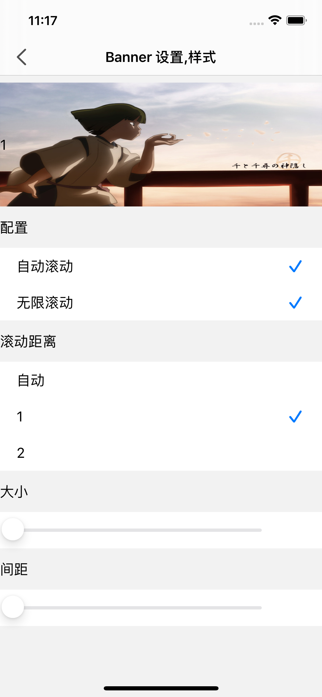
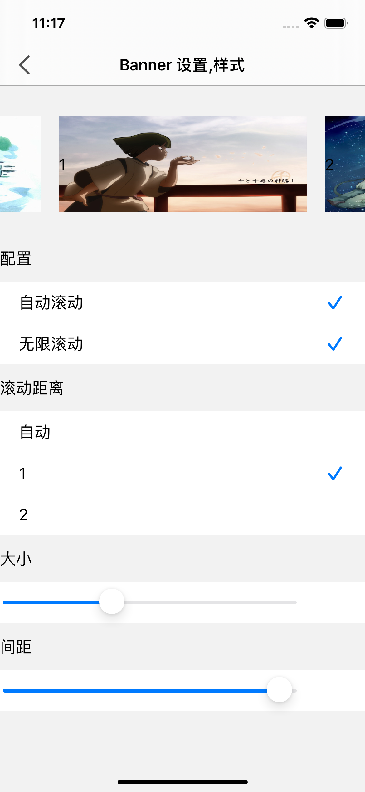

# SwiftPageView

[](https://cocoapods.org/pods/SwiftPageView)

FSPagerView魔改，去掉pageControl，修改部分代理方法，改Cell为注册机制，支持自定义Cell，可配置 文字+图片 混合Banner，或纯文字轮播，也能用在APP启动引导。

|  |  |
| ---------- | ---------- |
|  |  |
|  |            |

### 安装支持

#### cocoapods导入

```ruby
pod 'SwiftPageView'
```

#### SPM导入

`https://github.com/jackiehu/SwiftPageView`

#### 手动导入