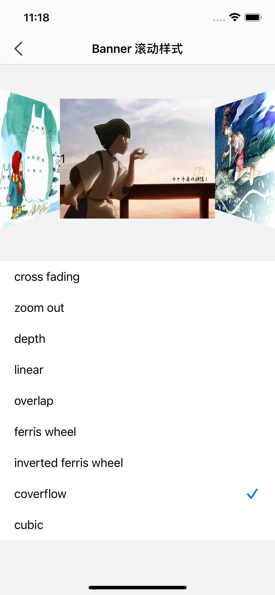

FSPagerView魔改，去掉pageControl，修改部分代理方法，改Cell为注册机制，支持自定义Cell，可配置 文字+图片 混合Banner，或纯文字轮播，也能用在APP启动引导。

|  |  |  |
| ---------------- | ---------------- | ---------------- |
|  |  |                  |

## 安装

### Cocoapods

1.在 Podfile 中添加 `pod ‘SwiftPageView’`

2.执行 `pod install 或 pod update`

3.导入 `import SwiftPageView`

### Swift Package Manager

从 Xcode 11 开始，集成了 Swift Package Manager，使用起来非常方便。SwiftPageView 也支持通过 Swift Package Manager 集成。

在 Xcode 的菜单栏中选择 `File > Swift Packages > Add Pacakage Dependency`，然后在搜索栏输入

`https://github.com/jackiehu/SwiftPageView`，即可完成集成

### 手动集成

SwiftPageView 也支持手动集成，只需把Sources文件夹中的SwiftPageView文件夹拖进需要集成的项目即可

## 更多砖块工具加速APP开发

